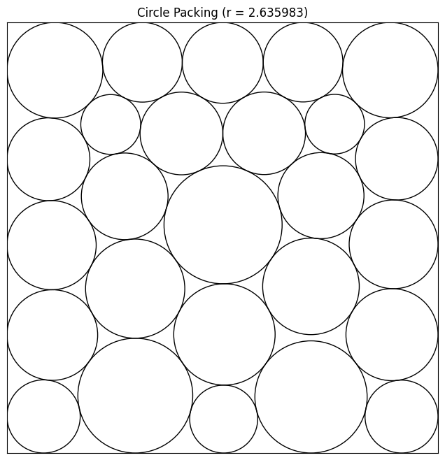

Achieved SOTA!
- Previous: 2.634
- AlphaEvolve: 2.63586275
- OpenEvolve: 2.634292402141039 (with assistance)
- Timo Berthold: 2.63591551 (FICO Xpress Solver)
- Me: 2.635983066

Pipeline

1. Sample database
2. Build prompt
3. Generate diff
4. Apply diff
5. Evaluate program
6. Store results

K-means sampling [TODO]

- Each program has a headline score which we are trying to maximise
- It also has secondary feature scores:
  - Run time
  - Memory usage
  - Program length
- We use k-means clustering to group the programs into feature islands
- Parents are sampled from each island weighted by their headline score
- Inspirations are sampled from other islands

Stochastic prompt building

- We encourage diversity by encoding random variations into the prompt text, e.g.:
  - "optimize":
        Try to optimize the previous completions by improving performance or reducing resource usage. 
        This might include optimizing algorithms, reducing memory usage, or improving execution speed. 
        The goal is to make the code more efficient and effective, which could lead to a higher score.
  - "rewrite":
        The previous completions have not made significant progress, so it is time to rewrite the code. 
        Use a SEARCH/REPLACE block with an empty SEARCH section to replace the entire parent program 
        with a new implementation. Don't be afraid to start from scratch and try a completely new approach. 
        The goal is to create a fresh implementation that could lead to a higher score, even if it means 
        discarding previous work. This could involve significant changes to the code or approach,
        so be creative and think outside the box.

Diff/reasoning generation

- AlphaEvolve's SEARCH/REPLACE blocks are used because LLMs struggle with unified diff format
- We allow a special case where the SEARCH block is an empty line, representing a complete rewrite
- We further enrich prompts by asking for reasoning with each diff and including this in future prompts

Program evaluation

- Untrusted code execution and evaluation is run in Docker containers
- Results are returned in the form of a scores and an artifacts json
- Docker containers can be hosted on Google Cloud and run as jobs

TODO
- generic analyses
- circle packing analyses
- wandb logging
- check for unevaluated (low prio)
- have a think about generations and migrations
  - if you don't improve on the parent score, the generation will not advance
  - the island can be stagnant until a neigbouring island that is improving migrates its elite
- config saving
- map elites: time remaining, diversity, simplicity
- generation and/or program count combined migration rules
